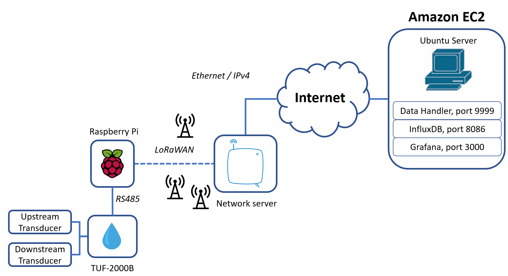

# IOT-UltrasonicWaterMeter
Author : Labinot Rashiti
Date : 24.07.2019

## Description

This project is about implementing a smart meter for water consumption using IoT and cloud technologies.

## Requirements

1x RaspberryPi

1x Waveshare USB TO RS485

1x TUF2000B

1x LoStik

1x IoT Network Server and some LoRa Gateways

1x Linux Server (AWS instance)

## How it works

### TUF-2000B

It's the ultrasonic flow meter sensor which is capable to measure water consumption. It has only a RS485 port to communicate with the outside world so we connect it to the Raspberry Pi to add an external communication and send data outside the box.

### Waveshare USB to RS485

This tool is an adapter USB to RS485. It permits the Raspberry Pi to communicate with the TUF2000B. The Raspberry Pi has only USB ports so this tool can convert USB to RS485 and establish a link with the water meter sensor.

### Raspberry Pi

The Raspberry Pi pulls the informations from the TUF-2000B with the USB connected to the RS485 interface. The data is exchanged using the Modbus RTU protocol. The Raspberry Pi use a script to get the measure each 5 minutes and send it to the IoT LoRa Gateways. Because the Raspberry Pi doesn't have a native LoRa interface, you must connect it with a LoStik (which is USB to LoRa adapter).

### IoT Network Server and gateways

The network server interconnect the sensor informations to an application. In our case, the Network Server receive the LoRa informations from the LoRa gateways and send it to the right application in the cloud. This part is not detailed because it depends a lot of the solution of the provider.

### Amazon cloud EC2

This is the cloud where is hosted your server. In our case, we simply use an Amazon instance to host some application. The data handler is a REST API server which collects the data sent from the IoT Network Server. This data handler will save the data in a influxdb database. Grafana will then grab these data and display it in a web interface.

## How to launch it 

1. Create an Amazon instance with a linux server (for example Ubuntu Server) and launch the server.py script
2. Register your LoStik adapter to your IoT Network with the joinLoRa.py script. Launch it from the Raspberry Pi.
3. Launch the sendFlowRateLora.py from the Raspberry Pi to gather the measure from the TUF-2000B and send it to the cloud.

### Will be updated soon...

